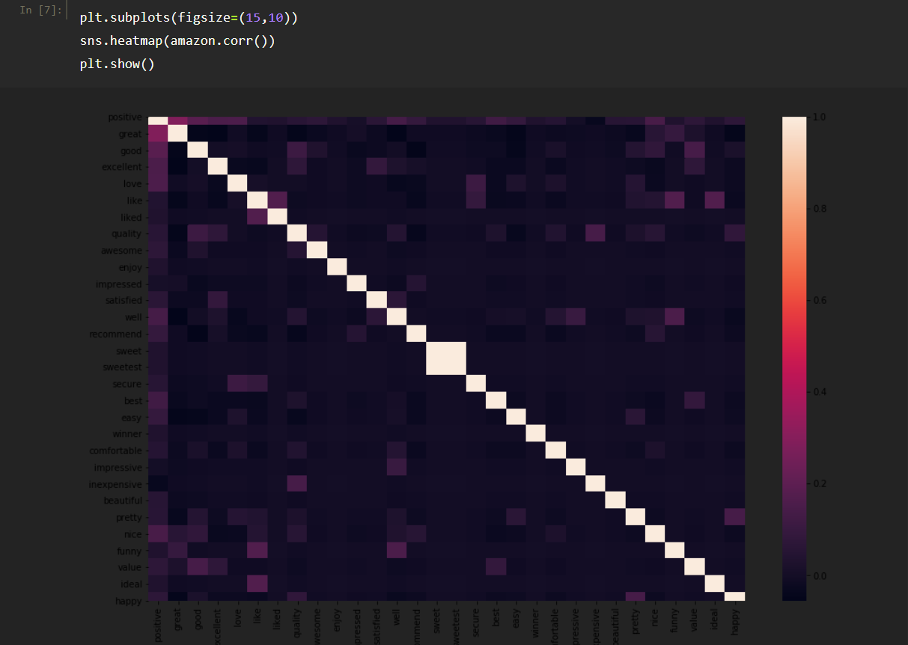

# Feedback Analysis

## Status
Project is: _in progress_

## Table of contents
* [Introduction](#introduction)
* [Screenshots](#screenshots)
* [Feature Engineering](#feature-engineering)
* [Conclusion](#conclusion)
* [Contact](#contact)

## Introduction
Add more general information about project. What the purpose of the project is? Motivation?

## Screenshots

## Feature Engineering 

### Method 1

### Method 2

### Method 3

## Conclusion

## Sources

## Contact
Created by [@glezzy](https://glezzy.github.io/) - feel free to contact me!
